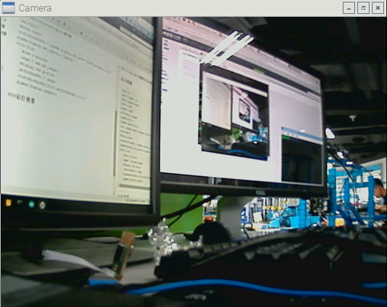

# 使用摄像头
准备一个USB摄像头，将摄像头插在树莓派的USB口上。
执行```ls /dev/video*```查看是否已出现摄像头设备。
###显示图像
```
import os
import pygame, sys
import pygame.camera
width = 640
height = 480
#initialise pygame   
pygame.init()
pygame.camera.init()
cam = pygame.camera.Camera("/dev/video0",(width,height))
cam.start()
#setup window
windowSurfaceObj = pygame.display.set_mode((width,height),1,16)
pygame.display.set_caption('Camera')
while True:
    #take a picture
    image = cam.get_image()
    #display the picture
    catSurfaceObj = image
    windowSurfaceObj.blit(catSurfaceObj,(0,0))
    pygame.display.update()
```
###运行效果


---
###获取图片任意像素的颜色
```
image = cam.get_image()
x = 100
y = 120
color = image.get_at((x,y))
print color
#(R, G, B, Alpha)
```
###运行结果
```
(65, 61, 76, 255)
```
---
###捕捉图像
在命令所在文件夹保存一张JPG格式的图片
```
pygame.image.save(windowSurfaceObj,'picture.jpg')
```
