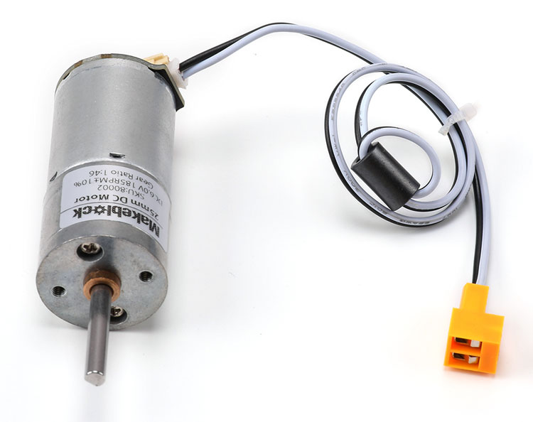
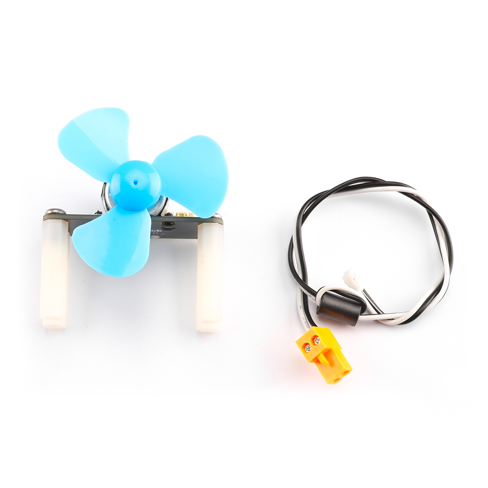

# 直流电机
直流电机是指能将直流电能转换成机械能（直流电动机）或将机械能转换成直流电能（直流发电机）的旋转电机。它是能实现直流电能和机械能互相转换的电机。当它作电动机运行时是直流电动机，将电能转换为机械能；作发电机运行时是直流发电机，将机械能转换为电能。

###直流减速电机

###130小电机

### Python 代码
```
from megapi import *

bot = MegaPi()
bot.start()
slot = 1
while True:
    sleep(1)
    bot.dcMotorRun(slot,80)
    sleep(1)
    bot.dcMotorRun(slot,0)
    sleep(1)
    bot.dcMotorRun(slot,-80)
    sleep(1)
    bot.dcMotorRun(slot,0)
```
### 运行结果