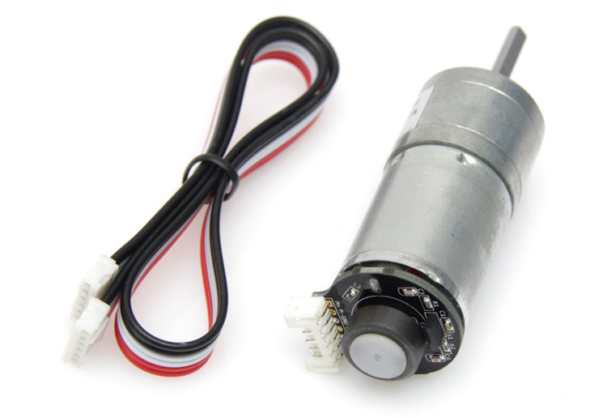

# 直流编码电机
普通直流电机没有反馈，无法精确控制旋转速度。在直流电机的旋转轴加上光电编码盘，我们就可以测量出旋转的速度。
###直流编码电机


### Python 代码
移动相对位置
```
from megapi import *

def onForwardFinish(slot):
	sleep(0.4);
	bot.encoderMotorMove(slot,100,-1000,onBackwardFinish);

def onBackwardFinish(slot):
	sleep(0.4);
	print slot;
	bot.encoderMotorMove(slot,100,1000,onForwardFinish);

if __name__ == '__main__':
	bot = MegaPi()
	bot.start()
    slot = 3
	bot.encoderMotorRun(slot,0)
	sleep(1);
	onForwardFinish(slot);
	while True:
		continue;
```
移动绝对位置
```
from megapi import *

def onForwardFinish(slot):
	sleep(0.4);
	bot.encoderMotorMove(slot,100,-1000,onBackwardFinish);

def onBackwardFinish(slot):
	sleep(0.4);
	print slot;
	bot.encoderMotorMove(slot,100,1000,onForwardFinish);

if __name__ == '__main__':
	bot = MegaPi()
	bot.start()
    slot = 3
	bot.encoderMotorRun(slot,0)
	sleep(1);
	onForwardFinish(slot);
	while True:
		continue;
```