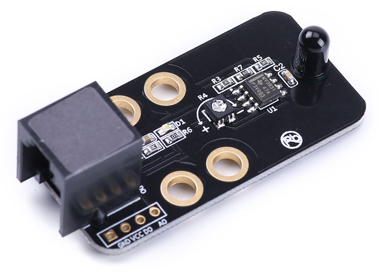

# 检测火焰

跟颜色传感器的原理类似，火焰的热辐射具有离散光谱的气体辐射和连续光谱的固体辐射。不同燃烧物的火焰辐射强度、波长分布有所差异，但总体来说，其对应火焰温度的近红外波长域及紫外光域具有很大的辐射强度,根据这种特性可制成火焰传感器。

### 火焰传感器


### Python 代码
```
from megapi import *

def onRead(v):
	print "flame level:"+str(v);

bot = MegaPi()
bot.start()
port = 6
while 1:
    sleep(0.1)
    bot.flameSensorRead(port,onRead)
```

### 运行结果


