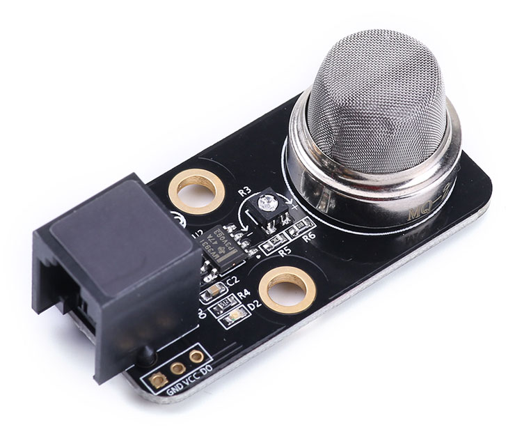

# 煤气检测

瓦斯主要成分是甲烷，是一种易燃易爆性气体，广泛存在与煤矿、矿井中，在工人进行作业时，必须保证瓦斯浓度在一个安全范围内。气体传感器是气体检测系统的核心，通常安装在探测头内。从本质上讲，气体传感器是一种将某种气体体积分数转化成对应电信号的转换器。半导体气体传感器是采用金属氧化物或金属半导体氧化物材料做成的元件，与气体相互作用时产生表面吸附或反应，引起以载流子运动为特征的电导率或伏安特性或表面电位变化。这些都是由材料的半导体性质决定的。  

### 瓦斯传感器



###连线

### Python 代码
```
from megapi import *

def onRead(v):
	print "gas level:"+str(v)

bot = MegaPi()
bot.start()
port = 6
while True:
    sleep(0.1)
    bot.gasSensorRead(port,onRead)
```
### 运行结果


