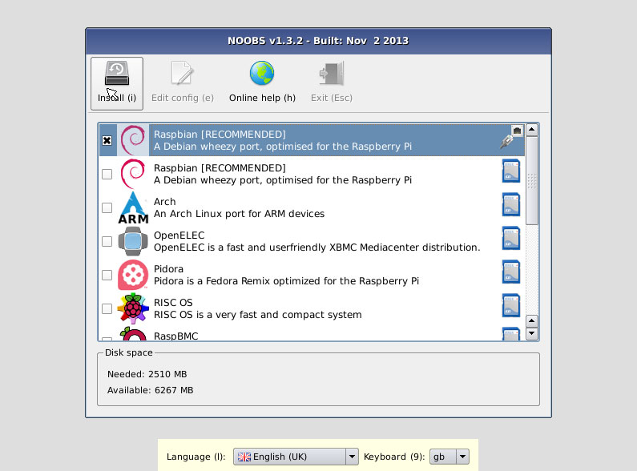

# 安装操作系统

准备材料：
* 树莓派2/3 B型 x1
* 不小于8G容量的micro sd卡 x1
* 支持HDMI的显示器 x1
* Micro USB线 x1
* Micro SD读卡器 x1
* 键盘鼠标 x1

步骤：
1. 在任意一台联网的电脑中下载最新的NOOBS文件 https://downloads.raspberrypi.org/NOOBS_latest
2. 通过读卡器解压NOOBS.zip到Micro SD卡根目录下
3. 将树莓派连上HDMI显示器、键盘鼠标
4. 将Micro SD卡插入树莓派
5. 通过Micro USB线使用5V电源或电脑USB口给树莓派供电
6. 树莓派将进入启动界面
7. 选择Raspbian，并点击Install开始安装系统
8. 等待系统安装完成

