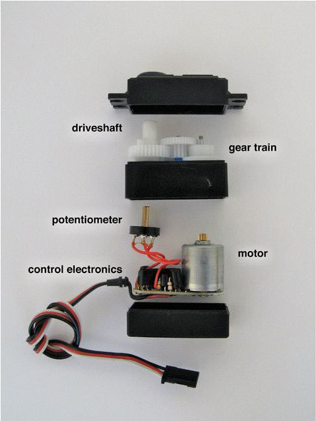

# 舵机

舵机（或简称舵机）是个糅合了多项技术的科技结晶体，它由直流电机、减速齿轮组、传感器和控制电路组成，是一套自动控制装置。对于舵机而言，位置检测器是它的输入传感器，舵机转动的位置一变，位置检测器的电阻值就会跟着变。通过控制电路读取该电阻值的大小，就能根据阻值适当调整电机的速度和方向，使电机向指定角度旋转。

###9克小舵机

###金属舵机

### Python 代码
```

```
### 运行结果
