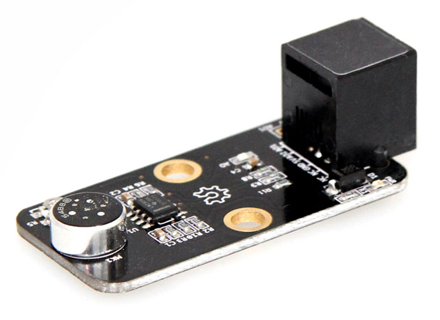

# 检测声音强度

声音传感器的作用相当于一个话筒（麦克风）。它用来接收声波，显示声音的振动图象。但不能对噪声的强度进行测量。

### 声音传感器


### Python 代码
```
from megapi import *

def onRead(v):
	print "sound level:"+str(v);

bot = MegaPi()
bot.start()
port = 6
while 1:
    sleep(0.1)
    bot.soundSensorRead(port,onRead)
```


### 运行结果


