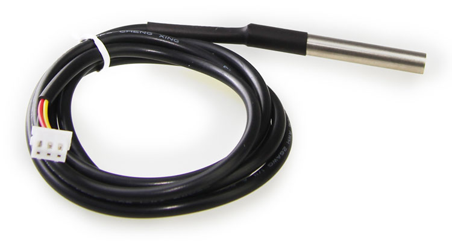
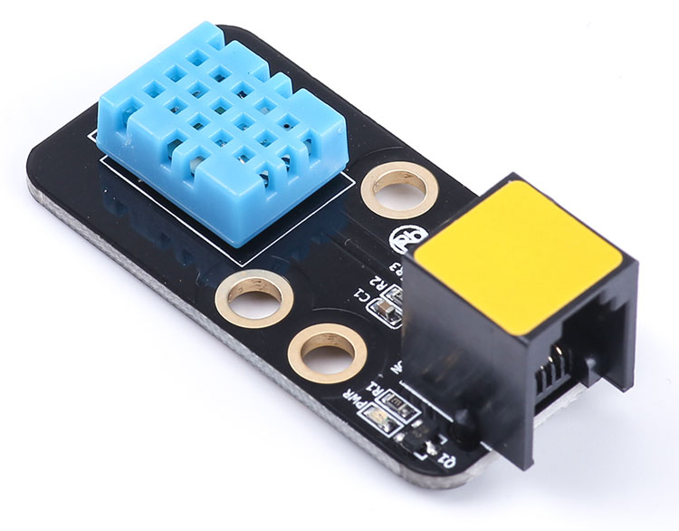

# 温度和湿度

金属随着温度变化，其电阻值也发生变化。对于不同金属来说，温度每变化一度，电阻值变化是不同的，而电阻值又可以直接作为输出信号。还有一种电阻叫湿敏电阻，它的特点是在基片上覆盖一层用感湿材料制成的膜，当空气中的水蒸气吸附在感湿膜上时，元件的电阻率和电阻值都发生变化，利用这一特性即可测量湿度。
###温度传感器

###Python 代码
```
from megapi import *

def onRead(v):
	print "Temperature:"+str(v)+" C"

bot = MegaPi()
bot.start()
port = 6
while 1:
    sleep(1)
    bot.temperatureSensorRead(port,onRead)
```
###运行结果


###温湿度传感器

###Python 代码
```
```
from megapi import *

def onRead(v):
	print "Humiture:"+str(v)+" %"

bot = MegaPi()
bot.start()
port = 6
while 1:
    sleep(1)
    bot.humitureSensorRead(port,0,onRead)
```
```
###运行结果
