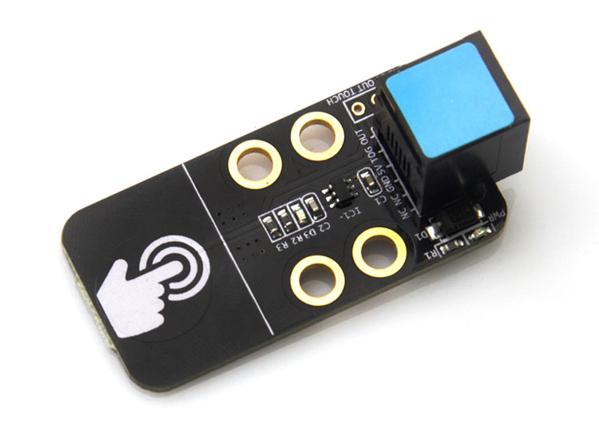

# 检测手指触摸

所有电容式触摸传感系统的核心部分都是一组与电场相互作用的导体。在皮肤下面，人体组织中充满了传导电解质(一种有损电介质)。正是手指的这种导电特性，使得电容式触摸传感成为可能。

### 触摸传感器


### Python 代码
```
from megapi import *

def onRead(v):
	print "touched:"+str(v);

bot = MegaPi()
bot.start()
port = 6
while 1:
    sleep(0.1)
    bot.touchSensorRead(port,onRead)
```

