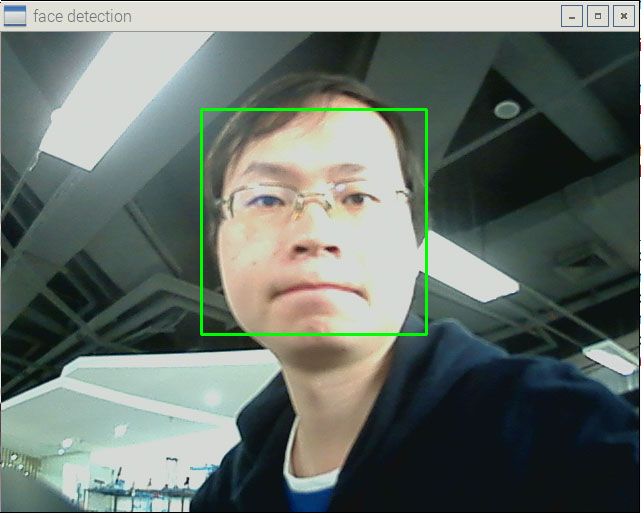

# 使用OpenCV
OpenCV的全称是：Open Source Computer Vision Library。OpenCV是一个基于BSD许可（开源）发行的跨平台计算机视觉库，可以运行在Linux、Windows和Mac OS操作系统上。它轻量级而且高效——由一系列 C 函数和少量 C++ 类构成，同时提供了Python、Ruby、MATLAB等语言的接口，实现了图像处理和计算机视觉方面的很多通用算法。

OpenCV在人机互动、物体识别、图像分割、人脸识别、动作识别、运动跟踪、运动分析、机器视觉、结构分析、汽车安全驾驶等领域有广泛应用。

###安装OpenCV
```
sudo apt-get install python-opencv
```
OpenCV-Python 在线教程：http://opencv-python-tutroals.readthedocs.org/en/latest/py_tutorials/py_tutorials.html
###显示图像
```
import cv2   

img = cv2.imread("picture.jpg")   
cv2.namedWindow("Image")   
cv2.imshow("Image", img)   
cv2.waitKey (0)  
cv2.destroyAllWindows()  
```
###获取像素信息
```
import cv2   

img = cv2.imread("picture.jpg")   
x = 100
y = 120
print img[x,y,0],img[x,y,1],img[x,y,2]
#Blue, Green, Red 
```
###调用摄像头并显示图像
```
import cv2
if __name__ == '__main__':
    cam = cv2.VideoCapture(0)
    while True:
        ret, img = cam.read()
        cv2.imshow('camera', img)
        if cv2.waitKey(5)==27:
            break #Press ESC to quit
    cam.release()
    cv2.destroyAllWindows()
```
###运行结果

###人脸识别
```
import cv2
def detectFace(img, cascade):
    rects = cascade.detectMultiScale(img, scaleFactor=1.3, minNeighbors=4, minSize=(30, 30),flags=cv2.CASCADE_SCALE_IMAGE)
    if len(rects) == 0:
        return []
    rects[:,2:] += rects[:,:2]
    return rects

def drawRects(img, rects, color):
    for x1, y1, x2, y2 in rects:
        cv2.rectangle(img, (x1, y1), (x2, y2), color, 2)

if __name__ == '__main__':
    cascade_fn = "/usr/share/opencv/haarcascades/haarcascade_frontalface_alt.xml"
    cascade = cv2.CascadeClassifier(cascade_fn)
    cam = cv2.VideoCapture(-1)
    while True:
        ret, img = cam.read()
        gray = cv2.cvtColor(img, cv2.COLOR_BGR2GRAY)
        gray = cv2.equalizeHist(gray)
        rects = detectFace(gray, cascade)
        vis = img.copy()
        drawRects(vis, rects, (0, 255, 0))
        cv2.imshow('face detection',  vis )
        if cv2.waitKey(5)==27:
            break
    cam.release()
    cv2.destroyAllWindows()
```
###运行结果

###视频直播
